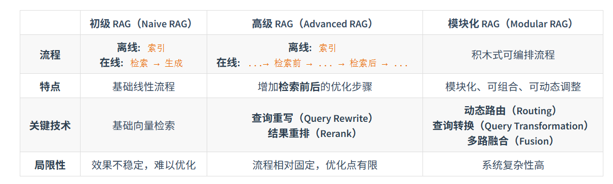
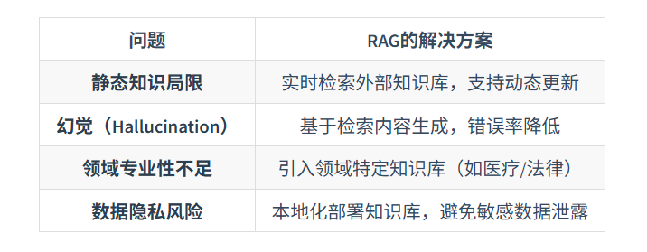

# `RAG` 简介

## 一. 技术原理

### 1.基本概念

`RAG`主要是由“参数化知识”和“非参数化知识”组成的。
其中，参数化知识指的是“模型通过内部学习得到的知识”
非参数化知识指的是“来自于外部知识库的知识”

其本质上的运作逻辑就是在LLM生成文本前，先通过检索机制从非参数化知识之中获取相关信息，
并且将这些参考信息融入生成过程，从而提升输出的准确性和时效性。

> PS: 按照我的理解，参数化知识就是调用`API`查询的过程，非参数化知识，就是已经存在的数据集合。

### 2.流程和技术原理

`RAG`流程主要由两个方面所组成，第一个组成方面是“检索阶段”和“生成阶段”。

- 检索阶段（主要目的是寻找非参数化知识）
  > 按照我的理解，就是去已经存在的知识库之中寻找相关的知识内容。
  > 
  > - 知识向量化：嵌入模型充当了连接器的角色，它将外部知识库编码为索引，存入数据库之中。
  > - 语义召回：
- 生成阶段（融合两种知识）

### 3.流程演变和突出特征

### 4、四步构建最小可行系统

（1）数据准备与清洗：这是系统的地基。我们需要将 PDF、Word 等多源异构数据标准化，并采用合理的分块策略（如按语义段落切分而非固定字符数），避免信息在切割中支离破碎。

（2）索引构建：将切分好的文本通过嵌入模型转化为向量，并存入数据库。可以在此阶段关联元数据（如来源、页码），这对后续的精确引用很有帮助。

（3）检索策略优化：不要依赖单一的向量搜索。可以采用混合检索（向量+关键词）等方式来提升召回率，并引入重排序模型对检索结果进行二次精选，确保 LLM 看到的都是精华。

（4）生成与提示工程：最后，设计一套清晰的Prompt 模板，引导 LLM 基于检索到的上下文回答用户问题，并明确要求模型“不知道就说不知道”，防止幻觉。
