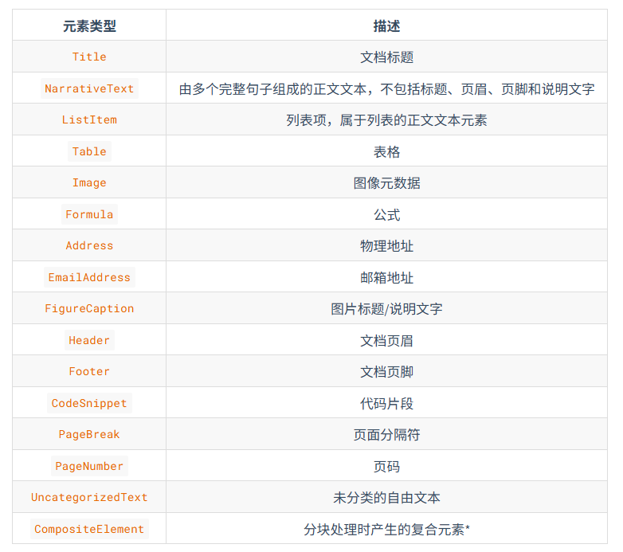

# 数据准备

## 1.数据加载

### 1.1.主流的文档加载器

文档加载器的作用（将杂乱的原始数据整理成可以进行向量化检索的标准化语料）：

- 将markdown、pdf、word等文件提取成纯文本
- 在提取过程之中，挑选出一些关键信息作为元数据
- 将纯文本和元数据整理成统一的数据结构，方便后续进行切分、向量化和入库

### 1.2.Unstructured文档加载器

## 2.数据分块

### 2.1.数据分块

RAG主要是通过嵌入模型将文本块转为向量，这种模型有严格的输入长度限制，所以在切块时，切块的尺寸应该“比较适合”。

> 比较适合：按照我的理解，指的应该是每块的特征，有且只有一个。

### 2.2.嵌入模型

嵌入模型的工作流程：

> 作用对象：文本块

- 分词：分词指的是将输入的文本块切分成一个一个token词。
- 向量化：向量化指的是为每一个token生成一个高维向量表示。
- 池化：将所有的高维向量聚集起来，通过某种方法，将所有的token压缩成一个单一的向量，这个向量就代表了整个文本块的语义。

